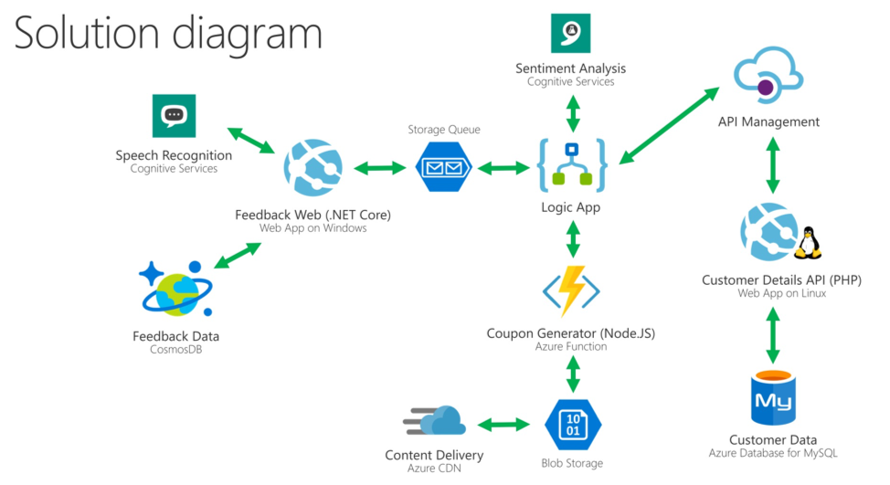

# Azure Customer Feedback Solution Lab

To start, fork the following Github repos to your account:
- http://github.com/sabbour/customerfeedback-web
- http://github.com/sabbour/customerfeedback-api
- http://github.com/sabbour/customerfeedback-functions

Download the lab guide and presentation then you're good to go:
- [Guide](https://github.com/sabbour/customerfeedback/blob/master/Technical%20Bootcamp%20-%20Azure%20Paas%20and%20Serverless%20(Handout).pdf)
- [Presentation](https://github.com/sabbour/customerfeedback/blob/master/Technical%20Bootcamp%20-%20Azure%20Paas%20and%20Serverless%20-%20Ahmed%20Sabbour.pptx)
